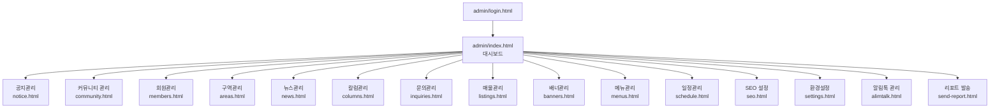
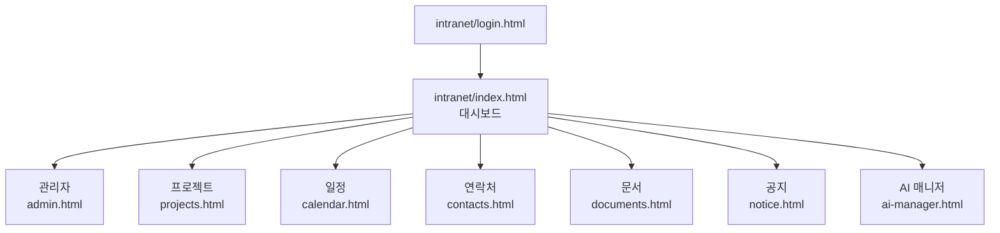
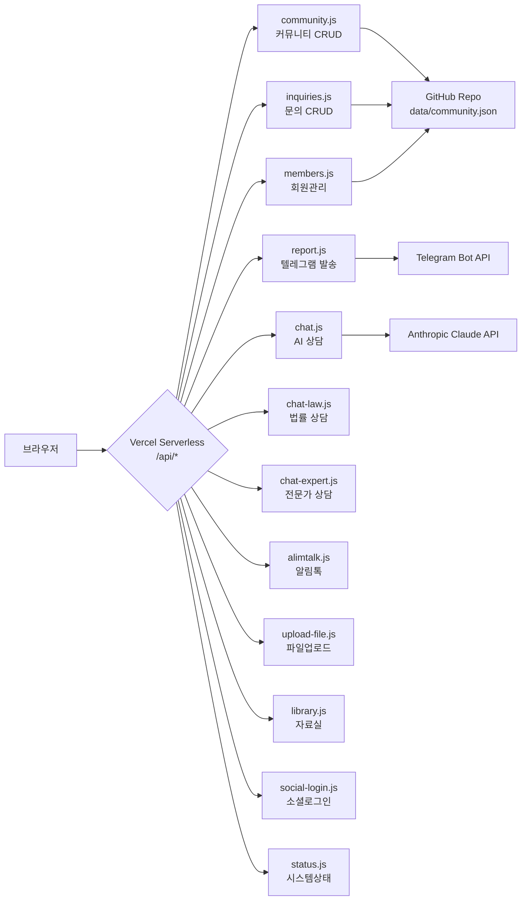

# 홈페이지 전체 구조도 (2026-04-19 기준)

## 1. 사이트 전체 페이지 구조

```mermaid
graph TD
  Home[index.html<br/>메인]

  Home --> About[회사소개<br/>about.html]
  Home --> Vision[세울의 길<br/>vision.html]
  Home --> Services[사업분야<br/>services.html]
  Home --> Portfolio[업무실적<br/>portfolio.html]
  Home --> Library[자료실<br/>library.html]
  Home --> Feasibility[사업성 검토<br/>feasibility.html]
  Home --> Contact[고객센터<br/>contact.html]

  Services --> RD[주택재개발<br/>redevelopment-service.html]
  Services --> RC[주택재건축<br/>reconstruction-service.html]
  Services --> SR[소규모재건축<br/>small-reconstruction-service.html]
  Services --> GJ[도심복합개발<br/>garoju-service.html]
  Services --> UP[도시계획<br/>urbanplanning-service.html]
  Services --> PM[PM/CM<br/>pmcm-service.html]

  Contact --> Consult[무료상담<br/>consultation.html]
  Contact --> Community[커뮤니티<br/>community.html]
  Contact --> Notice[공지사항<br/>notice.html]
  Contact --> FAQ[자주묻는질문<br/>faq.html]
  Contact --> Legal[법률안내<br/>legal-guide.html]

  Home -.로그인.-> Login[login.html]
  Login --> Register[register.html]
  Login --> FindId[find-id.html]
  Login --> ResetPw[reset-password.html]
  Login --> MyPage[mypage.html]

  Home -.지도.-> Location[정비사업DB<br/>location.html]
  Home -.계산.-> Calc[계산기<br/>calculator.html]
  Home -.허가.-> Permit[인허가지원<br/>permit-support.html]
  Home -.사이트맵.-> Sitemap[sitemap.html]

  Home -.외부.-> Webhard[웹하드<br/>webhard.html]
```



## 2. 관리자 페이지 구조



## 3. 인트라넷 (직원 전용) 구조



## 4. API 엔드포인트 구조



## 5. 디렉토리 트리

```
seul21/
├── CLAUDE.md                          # 프로젝트 운영 지침 (최상위 규정)
├── INCIDENT_REPORT_20260419.md        # 사건 경위서
├── BACKUP_YYYYMMDD.md                 # 과거 백업 설명서들
├── .github/
│   └── workflows/
│       ├── backup-to-gdrive.yml       # 주간 자동 백업
│       ├── build-deploy.yml           # 배포 파이프라인
│       ├── claude-telegram.yml        # PR/Push 알림
│       └── telegram-report.yml
├── docs/
│   └── backup-20260419/               # ← 이 백업 문서 세트
└── redevelopment/
    ├── index.html                     # 홈
    ├── vercel.json                    # Vercel 배포 설정
    ├── sitemap.xml
    ├── robots.txt
    ├── pages/                         # 34개 공개 페이지
    ├── admin/                         # 17개 관리자 페이지
    ├── intranet/                      # 8개 인트라넷 페이지
    ├── api/                           # 14개 서버리스 함수
    ├── assets/
    │   ├── css/common.css             # 공통 스타일
    │   ├── js/
    │   │   ├── common.js              # 헤더·푸터·드로어
    │   │   ├── chatbot.js             # 챗봇 UI
    │   │   └── data-service.js        # 데이터 접근 계층
    │   └── data/mock-data.js          # MOCK.library/library2/portfolio/areas
    ├── data/
    │   ├── community.json             # 커뮤니티 게시글
    │   ├── inquiries.json             # 고객 문의
    │   ├── members.json               # 회원 데이터
    │   └── alimtalk*.json             # 알림톡 로그
    ├── downloads/                     # 뉴스·법령·판례 상세 HTML
    │   └── files/                     # PDF 원본
    ├── uploads/community/             # 사용자 업로드 이미지
    └── jpg/                           # 사이트 이미지 자산
```

## 6. 페이지 수 집계

| 영역 | 수 |
|------|---|
| 공개 페이지 (`pages/`) | 34 |
| 관리자 페이지 (`admin/`) | 17 |
| 인트라넷 페이지 (`intranet/`) | 8 |
| 다운로드 상세 HTML (`downloads/`) | 다수 (뉴스·법령·판례) |
| API 엔드포인트 (`api/`) | 14 |
| 루트 (index/404 등) | 약 5 |
| **총계** | **약 78개+** |
