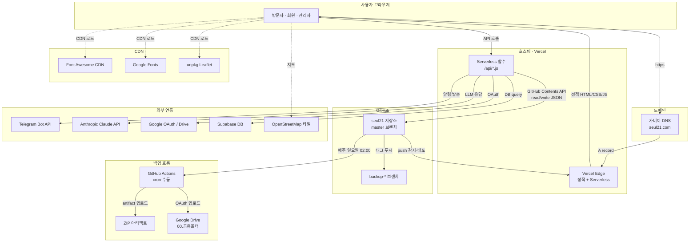
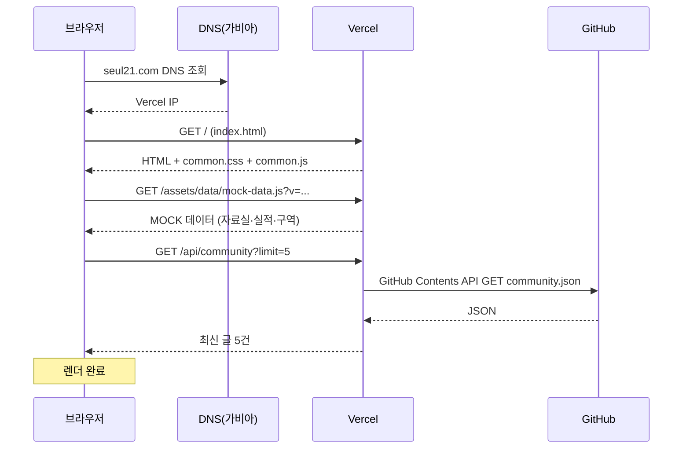
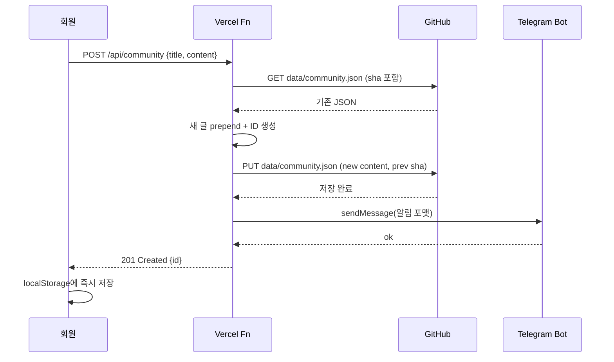
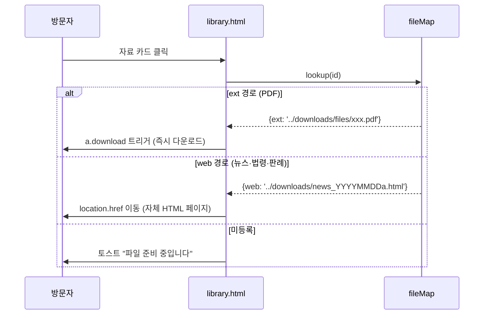
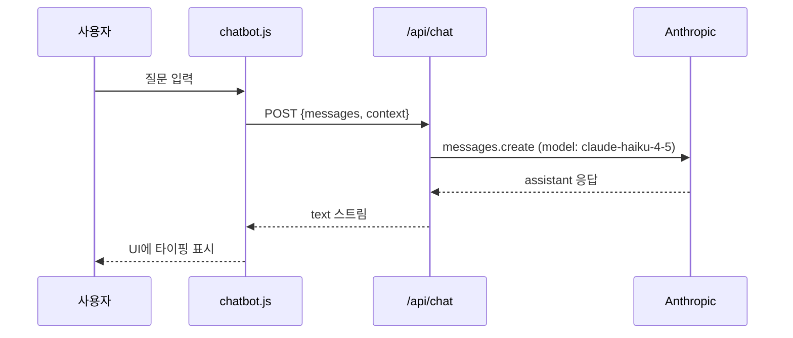

# 인터넷 연결 구성도 (시스템 데이터 흐름)

## 1. 전체 시스템 구성도

## 2. 페이지 로드 흐름

## 3. 커뮤니티 글 작성 흐름

## 4. 자료실 다운로드 흐름

## 5. AI 챗봇 흐름

## 6. 네트워크 포트·프로토콜

| From | To | Protocol | Port |
|------|-----|---------|------|
| 방문자 | seul21.com | HTTPS | 443 |
| Vercel | GitHub API | HTTPS | 443 |
| Vercel | Telegram API | HTTPS | 443 |
| Vercel | Anthropic API | HTTPS | 443 |
| GitHub Actions | Google Drive API | HTTPS | 443 |
| Vercel | Supabase | HTTPS (PostgREST) | 443 |

모든 통신은 TLS 1.2+ 암호화.

## 7. 장애 격리 지점

| 단일 장애점 | 영향 | 대체 |
|-------------|------|------|
| 가비아 DNS | 전체 사이트 접속 불가 | DNS 장애는 복제 방지 — 보조 DNS 검토 |
| Vercel | 전체 사이트 다운 | 대체 호스팅 사전 준비 필요 |
| GitHub API rate limit | 커뮤니티·문의 저장 실패 | 5000 req/h (authenticated) — 충분 |
| Telegram | 알림만 실패 | 본문 정상 저장됨 (비동기 try-catch) |
| Anthropic | AI 챗봇만 실패 | 일반 상담 폼으로 유도 |
